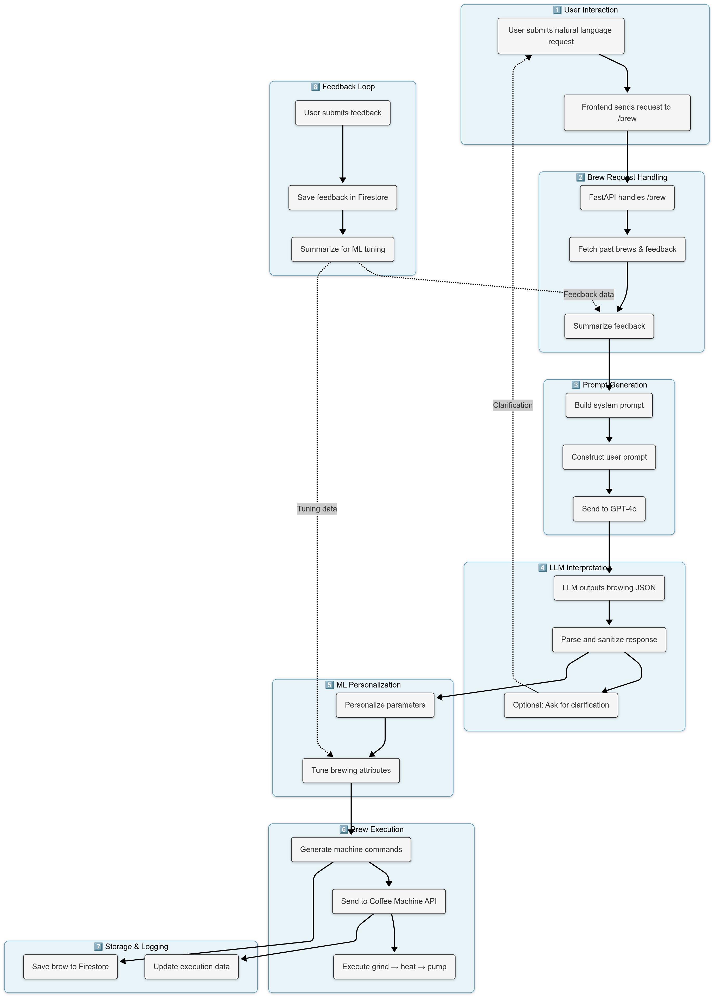

## **Machine Learning Module Documentation (AI Coffee Machine)**

### **Overview**

The **Machine Learning (ML)** module is a core component of the **AI Coffee Machine** project, responsible for processing user input, personalizing coffee brewing recommendations, and executing the brewing process. It integrates several components that work together to provide accurate, real-time suggestions based on user preferences, past interactions, and user feedback. The ML model continuously learns and adapts based on feedback, improving over time.

This section documents the **ML pipeline** and its key components, including how they work in **`main.py`**, which serves as the central execution point for the ML system.

---

### **Software Modules in the ML Pipeline**

The ML pipeline in the AI Coffee Machine project is implemented in **`main.py`**, and interacts with various other components for data processing, user interaction, feedback handling, and brewing execution.

1. **main.py**  
   This is the main entry point for the system, containing the FastAPI server and the logic that executes all processes, from receiving user input to making brewing recommendations and executing machine commands.

2. **Brew Request Handling**  
   This component processes incoming brew requests, handles user interactions, and retrieves past brewing data and feedback from Firestore. It plays a critical role in collecting data for personalized brewing recommendations.

3. **Feedback Loop**  
   The feedback loop collects user feedback after every brewing cycle. It stores feedback in **Firestore** and processes it to refine future brewing recommendations.

4. **Prompt Generation**  
   This module generates a structured prompt to feed to the **GPT-4 API** based on the user's input and brewing data. The prompt is tailored to capture the nuances of the user’s coffee preferences.

5. **LLM Handler**  
   The **LLMHandler** interfaces with the **GPT-4 API**, sending the generated prompts and receiving responses, which include personalized brewing recommendations. These responses are parsed and processed to extract actionable brewing instructions.

6. **ML Personalization**  
   After receiving the LLM output, the **ML Personalization** module customizes the brewing parameters (e.g., grind size, extraction time, temperature) to suit the individual user's preferences.

7. **Brew Execution**  
   This component generates machine commands based on personalized parameters and sends them to the **Coffee Machine API**, which controls the brewing process, including grinding, heating, and pumping.

8. **Storage & Logging**  
   All brewing and feedback data is stored in **Firestore**, ensuring that feedback, historical brews, and system logs are tracked and available for future interactions.

---

### **Machine Learning Pipeline Flow**

Below is a flowchart of the **ML pipeline** as described by the diagram you provided, illustrating the dependencies between the key modules:



The flowchart shows the sequential steps of the ML process, starting from user interaction through to feedback processing and final execution. 

---

### **How the ML System Works**

#### **1. User Interaction**
- The user submits their coffee preference as a **natural language request** (e.g., "I want a fruity espresso with chocolate notes").
- This input is sent to **FastAPI** as part of the `/brew` route.

#### **2. Brew Request Handling**
- **FastAPI** handles the incoming brew request.
- It retrieves historical brewing data and feedback from **Firestore** to personalize the recommendations based on previous interactions.

#### **3. Feedback Loop**
- **User Feedback**: After each brewing cycle, users provide feedback on the coffee (e.g., rating it from 1-5 or providing comments).
- The feedback is saved in **Firestore** and summarized for **ML tuning**, helping improve future recommendations.

#### **4. Prompt Generation**
- The system builds a structured prompt that combines user preferences and historical data. This prompt is prepared by the **PromptGenerator** and sent to the **GPT-4 API** for interpretation.

#### **5. LLM Interpretation (GPT-4 API)**
- **GPT-4** processes the prompt and generates a response in the form of a **brewing JSON**, containing all the recommended brewing parameters (e.g., grind size, extraction time, temperature).
- The response is parsed and sanitized to ensure it is usable by the system.

#### **6. ML Personalization**
- The system personalizes the brewing parameters based on the user's input and feedback. This step adjusts key variables like grind size, extraction time, and water temperature to match the user’s preferences.

#### **7. Brew Execution**
- The final **personalized parameters** are used to generate machine commands (e.g., grind settings, heat levels, pump time).
- These commands are sent to the **Coffee Machine API** to execute the brewing process.

#### **8. Storage & Logging**
- **Brew data** and **user feedback** are stored in **Firestore**, enabling continuous refinement and logging of brewing results for future reference.

---

### **Dev/Build Tool Information**

The following tools and libraries are required for the development and execution of the ML module:

- **Python 3.8.1**: Python was used for the development of all ML code. Ensure to use Python 3.8.x or later.
- **FastAPI 0.63**: For building the web server that handles incoming brew requests and integrates the ML model.
- **TensorFlow 2.4**: Used for initial ML model training and evaluation (regression models like Random Forest, Gradient Boosting, and Linear Regression).
- **OpenAI GPT-4 API**: Used for generating personalized recommendations based on user input.
- **scikit-learn 0.24.2**: For building and evaluating traditional ML models (Random Forest, Gradient Boosting).
- **pandas 1.2.4**: For data manipulation and preprocessing.
- **requests 2.25.1**: For making HTTP requests to external services like GPT-4 and the Coffee Machine API.

---

### **How to Install the Machine Learning Software Stack from Scratch**

1. **Prepare Your Environment**:  
   - Ensure that you have **Python 3.8+** installed.
   - Create a new Python virtual environment:
     ```bash
     python3 -m venv venv
     source venv/bin/activate
     ```

2. **Install Dependencies**:
   - Install the necessary Python libraries:
     ```bash
     pip install fastapi==0.63
     pip install tensorflow==2.4
     pip install scikit-learn==0.24.2
     pip install pandas==1.2.4
     pip install openai==0.11.3
     pip install requests==2.25.1
     pip install firebase-admin==4.5.0
     pip install python-dotenv==0.17.1
     ```

3. **Set Up GPT-4 API Access**:
   - Sign up for **OpenAI GPT-4 API** access and obtain your API key from [OpenAI](https://www.openai.com/).
   - Set up environment variables in the backend folder for secure access to the API:
     ```bash
     export OPENAI_API_KEY="your-api-key-here"
     ```

4. **Clone Repository**:
   - Clone the repository and navigate to the project folder:
     ```bash
     git clone https://github.com/NaomiGonz/AICoffee-Machine.git
     cd backend
     ```

5. **Run the ML Model**:
   - Start the ML system with the following command, which will also start the FastAPI server:
     ```bash
     python main.py
     ```